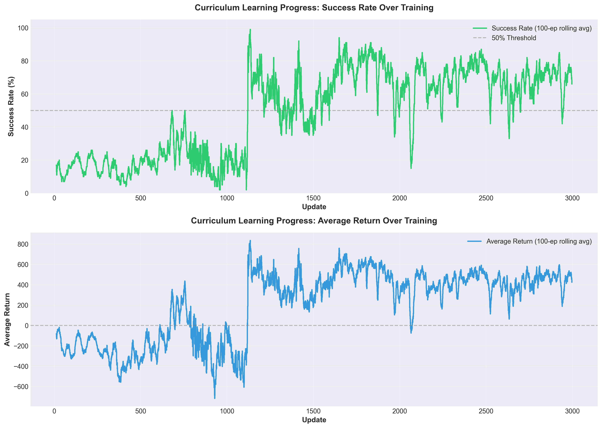
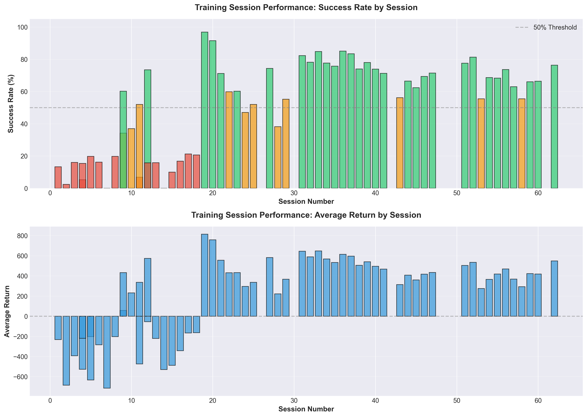
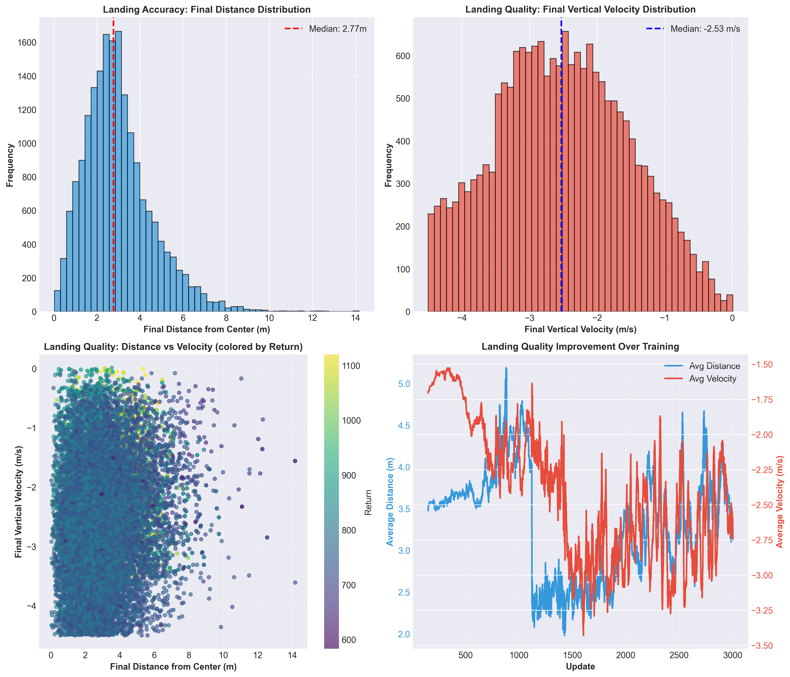
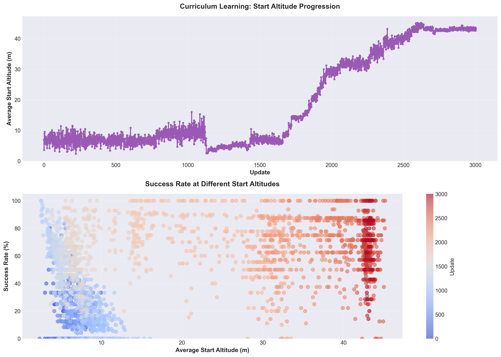
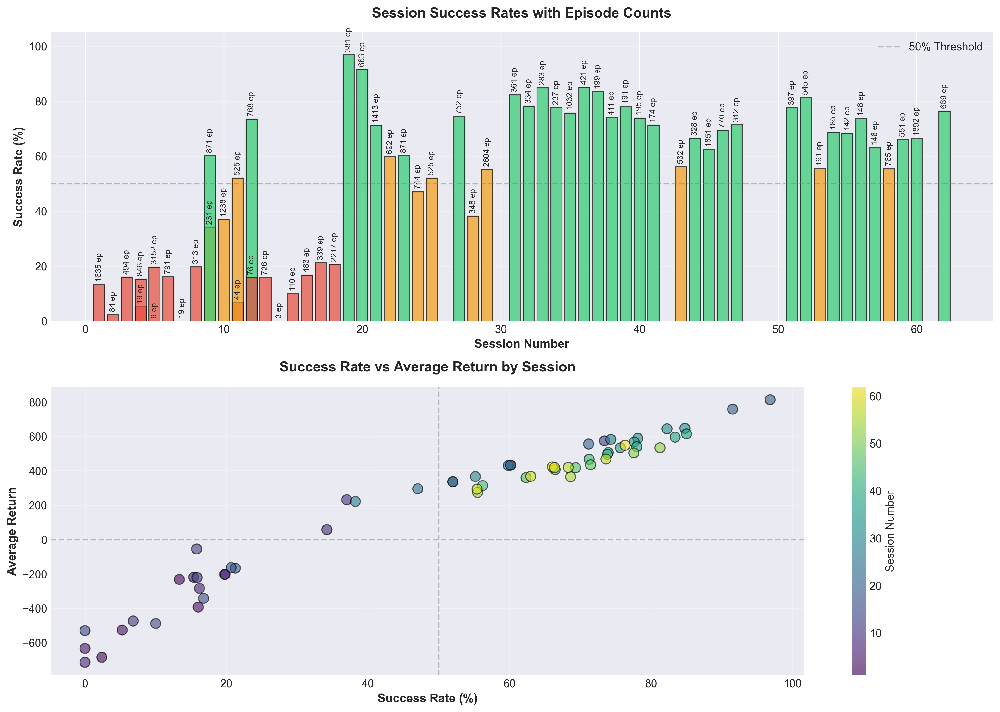
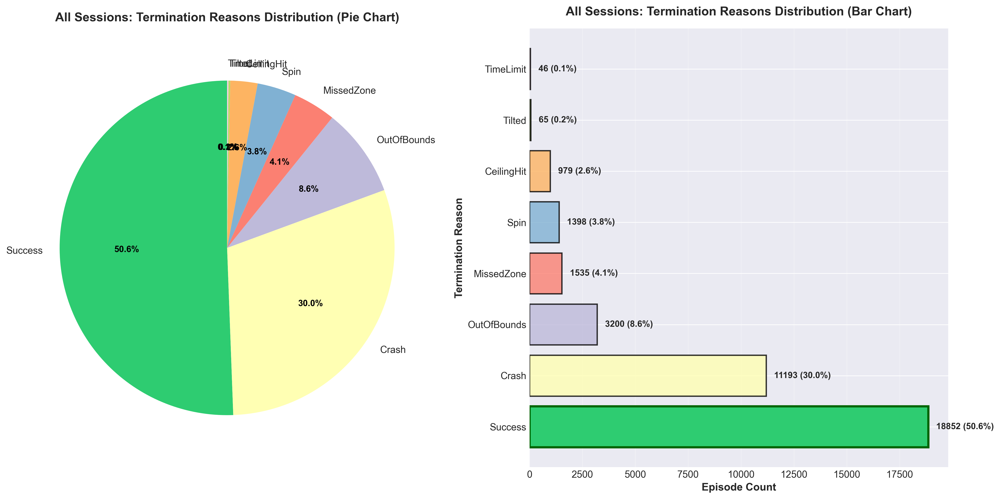

# REİNFORCEMENT LEARNING (PEKİŞTİRMELİ ÖĞRENME) İLE 3 BOYUTLU DİKEY İNİŞLİ ROKET KONTROLÜ


Bu proje, yapay zeka kullanarak bir roketin otonom olarak dikey iniş yapmasını öğreten bir derin pekiştirmeli öğrenme (Deep Reinforcement Learning) simülasyonudur. Unity fizik motoru ile gerçekçi bir 3D ortamda, PPO (Proximal Policy Optimization) algoritması kullanılarak eğitilen bir AI ajanı, farklı başlangıç koşullarından (farklı yükseklikler, konumlar ve açılar) başlayarak roketi hedef bölgeye güvenli bir şekilde indirmeyi öğrenir.

Proje, curriculum learning (müfredat öğrenme) yaklaşımıyla kademeli olarak zorluk seviyesini artırarak eğitim yapar. Başlangıçta düşük irtifalardan (5-15m) başlayıp, ajanın temel kontrol becerilerini öğrendikten sonra daha yüksek irtifalara (40m+) geçiş yapar. Bu sayede ajan önce dikey hız kontrolünü, sonra açısal denge kontrolünü öğrenir.

## Proje Yapısı

```
vertical-landing-project/
├── scripts/                # Python eğitim ve test scriptleri
│   ├── train_main.py       # Ana eğitim scripti
│   ├── agent.py            # PPO ajan uygulaması
│   ├── env.py              # Ortam wrapper'ı ve ödül fonksiyonu
│   ├── connector.py        # Unity-Python iletişim köprüsü
│   └── play_test.py        # Model test scripti
├── rocket-env/             # Unity proje dizini
│   ├── Assets/
│   │   ├── Scripts/
│   │   │   └── env.cs      # Unity ortam scripti (fizik simülasyonu)
│   │   ├── Scenes/         # Unity sahneleri
│   │   └── Settings/       # Unity ayarları
│   ├── ProjectSettings/    # Unity proje ayarları
│   └── Packages/           # Unity paket bağımlılıkları
├── models/                 # Eğitilmiş modeller ve loglar
│   ├── rocket_model_up*.keras    # PPO model checkpoint'leri
│   ├── rocket_state_up*.pkl.gz   # Agent state checkpoint'leri
│   ├── env-icerik_up*.txt        # Ortam parametre snapshot'ları
│   ├── episode_logs.csv          # Episode bazlı loglar
│   ├── update_logs.csv           # Update bazlı training metrikleri
│   ├── detailed_log.csv          # Detaylı episode bilgileri
│   ├── state_log.csv             # Adım bazlı state/action logları
│   └── phased tests and backups/ # Backup klasörü
│       ├── low_stage_backup/     # En iyi düşük aşama modeli yedeği
│       └── v*-low/               # Çeşitli checkpoint yedekleri
├── analyses/               # Eğitim analiz scriptleri ve belgeleri
│   ├── analyze_sessions.py            # Session bazlı analiz scripti
│   ├── analyze_training.py            # Genel training analiz scripti
│   ├── analyze_detailed_log_segments.py  # Log segmentasyon scripti
│   ├── detailed_log_analysis/     # Segmentlenmiş log dosyaları
│   │   ├── session_*.csv          # Her training session'ı için CSV
│   │   └── session_analysis.txt   # Session analiz raporları
│   └── *.txt                      # Çeşitli analiz raporları
├── images/                 # Analiz grafikleri (PNG formatında)
│   ├── curriculum_progression.png
│   ├── session_performance_timeline.png
│   ├── landing_quality_analysis.png
│   ├── start_altitude_progression.png
│   ├── session_success_rates.png
│   └── all_sessions_termination_reasons.png
├── videos/                 # Demo videoları
├── CHANGELOG.md            # Proje değişiklik geçmişi
└── README.md               # Bu dosya
```

## Kullanılan Sürümler ve Kurulum

### Sistem Gereksinimleri

- **Python**: 3.7.16 (Conda environment: `rl_codes`)
- **TensorFlow**: 2.10.1 (Keras API ile)
- **CUDA**: 13.0 (V13.0.48) - GPU desteği için (opsiyonel, CPU ile de çalışır)
- **Unity**: 6.0+ (Universal Render Pipeline)
- **NumPy**: Sayısal hesaplamalar için

### Kurulum Adımları

1. **Depoyu klonlayın veya indirin**

2. **Conda environment'ı aktif edin**:
   ```bash
   conda activate rl_codes
   ```

3. **Gerekli kütüphaneleri yükleyin**:
   ```bash
   pip install numpy tensorflow==2.10.1 matplotlib seaborn pandas
   ```

4. **Unity projesini hazırlayın**:
   - `rocket-env/` klasöründeki Unity projesini Unity Editor'de açın
   - Sahne içinde roket ve hedef nesnelerin olduğundan emin olun

## Kullanılan Algoritmalar, Kütüphaneler ve Fiziksel Koşullar

### PPO (Proximal Policy Optimization) Algoritması

Bu projede **PPO** (Proximal Policy Optimization) algoritması kullanılıyor. PPO, pekiştirmeli öğrenmede kullanılan modern ve etkili bir yöntemdir.

#### PPO Nasıl Çalışır?

PPO algoritması, aşağıdaki adımlardan oluşan bir döngü halinde çalışır:

**1. Veri Toplama (Rollout Phase)**:
- Ajan mevcut policy'si ile ortamda 1800 adım (rollout length) boyunca etkileşime girer
- Her adımda: mevcut durumdan (state) bir aksiyon seçilir, ortam adımlanır, ödül ve yeni durum alınır
- Toplanan veriler: states, actions, rewards, done flags, value tahminleri (V(s)) ve eski policy'nin log olasılıkları (old_logp) saklanır

**2. GAE (Generalized Advantage Estimation) Hesaplama**:
- GAE, Monte Carlo ve Temporal Difference (TD) yöntemlerinin bir kombinasyonudur
- Her adım için advantage değeri (A_t) hesaplanır: 
  ```
  δ_t = r_t + γ*V(s_{t+1}) - V(s_t)  (TD hatası)
  A_t = δ_t + (γ*λ)*δ_{t+1} + (γ*λ)²*δ_{t+2} + ...  (GAE)
  ```
- Bu sayede hem düşük varyanslı hem de düşük bias'lı advantage tahminleri elde edilir
- λ (GAE lambda = 0.95) parametresi bias-variance trade-off'unu kontrol eder

**3. Policy Güncelleme (Clipped Surrogate Objective)**:
- PPO'nun temel özelliği, policy güncellemelerini "güvenli" bir aralıkta tutmaktır
- Eski ve yeni policy arasındaki oran (ratio) hesaplanır: `ratio = π_new(a|s) / π_old(a|s)`
- Clipped surrogate loss kullanılır:
  ```
  L_clip = E[min(ratio * A, clip(ratio, 1-ε, 1+ε) * A)]
  ```
- Bu formül sayesinde, policy çok hızlı değişirse (ratio çok büyük veya küçükse) güncelleme sınırlandırılır
- ε (clip epsilon = 0.1) parametresi güncelleme aralığını kontrol eder

**4. Value Fonksiyonu Güncelleme**:
- Value network (V(s)) gerçek getiri (return) değerlerine göre güncellenir: `L_value = MSE(V(s), Return)`
- Return değeri: `Return = Advantage + V(s)` (GAE'den sonra)

**5. Entropy Bonus**:
- Policy'nin çeşitliliğini korumak için entropy bonus eklenir
- Bu sayede ajan erken bir optimal çözüme takılıp kalmaz (premature convergence önlenir)
- Entropy bonus = `-entropy_coef * entropy(π)`

**6. Toplam Loss ve Gradyan Güncelleme**:
- Toplam loss: `L_total = L_policy + vf_coef*L_value - ent_coef*entropy`
- Gradyanlar hesaplanır ve gradyan clipping uygulanır (max_grad_norm = 0.5)
- Policy ve value network'ler birlikte güncellenir
- Aynı rollout verileri üzerinde 4 epoch boyunca mini-batch'ler halinde (batch_size = 256) eğitim yapılır

**7. Eylem Üretimi (Continuous Actions)**:
- Policy, Gaussian dağılımı kullanır: `a ~ N(μ(s), σ²)`
- Ağdan çıkan `μ(s)` (mean) ve öğrenilen `log_std` parametreleri ile Gaussian'dan örnek alınır
- Çıkan aksiyon `tanh` fonksiyonu ile [-1, 1] aralığına sıkıştırılır (action squashing)
- Bu squashing için log probability düzeltmesi (correction term) uygulanır

**PPO'nun Avantajları**:
- Büyük policy güncellemelerini önleyerek stabil eğitim sağlar (clipping mekanizması)
- Genelleştirilmiş Avantaj Tahmini (GAE) ile daha verimli öğrenme
- Ayrı policy ve value ağları ile daha iyi değer tahmini
- Entropy ile exploration (keşif) ve exploitation (sömürme) dengesini korur
- Aynı rollout verilerini birden fazla kez kullanabilir (sample efficiency)

### Ağ Mimarisi

- **Ortak Backbone**: 3 katmanlı MLP (tanh aktivasyonlu, 256 nöron her katmanda)
  - Girdi: 13 boyutlu normalize edilmiş durum vektörü
  - Hidden layers: 256 → 256 → 256 (hepsi tanh aktivasyonlu)
- **Policy Head**: Ortak backbone'dan gelen özellikler üzerinde
  - Çıktı: 4 boyutlu mean vektörü (μ) - Gaussian dağılımının ortalaması
  - Bu mean ve öğrenilen log_std ile Gaussian'dan örnek alınır
  - Sonrasında tanh ile [-1, 1] aralığına sıkıştırılır (action squashing)
- **Value Head**: Aynı ortak backbone'u paylaşır
  - Çıktı: Skaler değer tahmini V(s)

### Ana Hiperparametreler

- Öğrenme Oranı: 1e-4
- İndirim Faktörü (γ): 0.99
- GAE Lambda (λ): 0.95
- Clip Epsilon: 0.1
- Değer Fonksiyonu Katsayısı: 0.5
- Entropy Katsayısı: 0.02
- Update Başına Epoch: 4
- Batch Boyutu: 256
- Maksimum Gradyan Normu: 0.5
- Rollout Uzunluğu: 1800 adım

### Durum ve Aksiyon Uzayı

#### Durum Vektörü (13 boyut)

1. Yatay pozisyon X (dx)
2. İrtifa Y (dy) - roketin alt sensöründen ölçülen
3. Yatay pozisyon Z (dz)
4. Doğrusal hız X (vx)
5. Doğrusal hız Y (vy)
6. Doğrusal hız Z (vz)
7. Açısal hız X (wx)
8. Açısal hız Y (wy)
9. Açısal hız Z (wz)
10. Rotasyon quaternion X (qx)
11. Rotasyon quaternion Y (qy)
12. Rotasyon quaternion Z (qz)
13. Rotasyon quaternion W (qw)

**Not**: Quaternion kullanılmasının sebebi, Euler açılarında yaşanan "359° → 0°" sıçrama sorununu önlemek ve ajanın öğrenmesini stabilize etmektir.

**Durum Normalizasyonu**: Durumlar, pozisyon/hız bileşenleri için normalize edilir. Normalizasyon stratejisi:
- **Yatay pozisyon (dx, dz)**: Basit normalizasyon - 45.0 ölçeğine bölünür ve [-1, 1] aralığına kırpılır
- **İrtifa (dy)**: Log-compression normalizasyon - 50.0 ölçeği kullanılır (`sign(x) * log1p(abs(x)/scale)`)
- **Doğrusal hız (vx, vy, vz)**: Log-compression normalizasyon - 25.0 m/s ölçeği kullanılır
- **Açısal hız (wx, wy, wz)**: Log-compression normalizasyon - 4.0 rad/s ölçeği kullanılır
- **Quaternion (qx, qy, qz, qw)**: Zaten [-1, 1] aralığında olduğu için normalizasyona ihtiyaç duymaz

Log-compression normalizasyon, düşük değerlerde hassasiyeti korurken yüksek değerlerde aşırı doyumu önler ve sinir ağı öğrenimini stabilize eder.

#### Aksiyon Uzayı (4 sürekli boyut)

- **Pitch**: X ekseni etrafında rotasyon (RCS tork kontrolü) [-1, 1]
- **Yaw**: Z ekseni etrafında rotasyon (RCS tork kontrolü) [-1, 1]
- **Thrust**: Ana motor dikey itkisi [0, 1]
- **Roll**: Y ekseni etrafında rotasyon (RCS tork kontrolü) [-1, 1]

**Fizik Uygulama**: Pitch/Yaw/Roll için `Rigidbody.AddTorque()` kullanılır. Thrust için `Rigidbody.AddRelativeForce()` kullanılarak roketin kendi dikey ekseninde kuvvet uygulanır.

### Unity Fiziksel Parametreler

Roket ve ortamın fiziksel özellikleri Unity'de şu şekilde yapılandırılmıştır:

**Roket Özellikleri**:
- **Kütle**: 1000 kg
- **Ana Motor İtki Gücü**: 20,000 N (maksimum)
- **RCS İtki Gücü**: 
  - Pitch/Yaw: 1,200 N
  - Roll: 120 N (Pitch/Yaw'un %10'u)
- **Doğrusal Sönümleme**: 0.01
- **Açısal Sönümleme**: 0.2
- **Yerçekimi**: Unity default (9.81 m/s²)

**Başlangıç Koşulları** (Curriculum Learning):
- **İrtifa Aralığı**: 44.5m - 47.0m (mevcut aşama)
- **Yatay Pozisyon**: -3.0m ile +3.0m arası (X ve Z eksenleri)
- **Başlangıç Açıları**: Pitch ve Yaw için -2.0° ile +2.0° arası rastgele

**Hedef Bölge**:
- **Merkez**: (0, 0, 0)
- **Başarı Yarıçapı**: 10.0m (yatay mesafe)
- **Başarı Yüksekliği**: ≤ 1.7m

### Ödül Fonksiyonu

Ödül fonksiyonu birden fazla bileşenden oluşur:

#### Terminal Ödüller

**Success (Başarılı İniş)**: +2000 (temel ödül) + zaman bonusu (0-300 arası)
- **Yükseklik koşulu**: Roket yere 1.7m veya daha yakın olmalı
- **Yatay mesafe koşulu**: Hedef merkeze yatay mesafe 15.2m'den az olmalı
- **Dikey hız koşulu**: Dikey hız mutlak değeri 4.5 m/s'yi geçmemeli (yumuşak iniş)
- **Yatay hız koşulu**: Yatay hız 4.0 m/s'yi geçmemeli (kontrollü iniş)
- **Oryantasyon koşulu**: Roket dikeyden 15°'den fazla eğik olmamalı (up_y ≥ 0.85)
- **Açısal hız koşulu**: Toplam açısal hız 5.0 rad/s'yi geçmemeli (spin yok)
- **Zaman bonusu**: Episode ne kadar erken biterse o kadar fazla bonus (maksimum ~300)

**Crash (Çarpışma)**: -300
- Başarı koşullarından biri sağlanmazsa (yüksek hız, eğik iniş, vb.)

**CeilingHit (Tavan Çarpması)**: -1200
- Roket yukarı doğru hareket ederken (vy > 0.3 m/s) 54m irtifayı aşarsa
- Yukarı kaçmayı önlemek için yüksek ceza

**OutOfBounds (Sınır Dışı)**: -675
- Roket yatay olarak 20m'den fazla uzaklaşırsa (|dx| ≥ 20m veya |dz| ≥ 20m)

**MissedZone (Hedef Bölge Dışı)**: Kademeli ceza (-150 ile -350 arası)
- Roket yere iner ama hedef bölge dışına düşerse
- Merkeze yakınlığa göre: 8.5m'de -150, uzaklaştıkça artarak maksimum -350

**Spin (Dönüş)**: -675
- Toplam açısal hız 7.3 rad/s'yi aşarsa
- Roket kontrolsüz dönmeye başlarsa

**Tilted (Eğik)**: -500
- Roket çok eğik duruma gelirse (up_y < 0.35, yaklaşık 70° eğik)

#### Adım Ödülleri
- Yatay mesafe cezası (kademeli: metre başına -0.1'den -0.25'e)
- Dikey hız cezası (irtifaya bağlı, kademeli)
- Yükseklik cezası (çok yüksekten başlama için)
- Yukarı hareket cezası (yükselmeyi caydırır)
- Yatay hız cezası (m/s başına -0.09)
- Açısal hız cezası (rad/s başına -0.04)
- Merkeze yaklaşma bonusu (üstel, en fazla +0.35)
- Yavaş iniş bonusu (en fazla +0.06)
- Yüksek irtifa ek cezası (dy > 48m)

Son adım ödülü, değer fonksiyonu öğrenimini stabilize etmek için 0.35x ile ölçeklenir.

### Kullanılan Python Kütüphaneleri

- **TensorFlow 2.10.1**: Derin öğrenme framework'ü (Keras API)
- **NumPy**: Sayısal hesaplamalar ve array işlemleri
- **Matplotlib**: Grafik oluşturma
- **Seaborn**: İstatistiksel görselleştirme
- **Pandas**: Veri analizi ve CSV işleme

## Projenin Runtime Akışı

### Eğitim Süreci (train_main.py)

Eğitim süreci şu adımlardan oluşur:

1. **Başlangıç ve Model Yükleme**:
   - GPU ayarları yapılır (CUDA varsa)
   - Eğitilmiş model varsa: En son kaydedilmiş model otomatik olarak bulunur ve yüklenir, eğitime kaldığı yerden devam edilir (checkpoint'ten)
   - Eğitilmiş model yoksa: Yeni bir model oluşturulur ve eğitime sıfırdan başlanır

2. **Episode Döngüsü**:
   - Her episode başında `env.initialStart()` çağrılır:
     - Unity'ye reset komutu gönderilir (mode=1)
     - Roket için rastgele başlangıç parametreleri üretilir:
       * İrtifa (y): `init_y_min` ile `init_y_max` arası rastgele (ör. 44.5m - 47.0m)
       * Yatay X pozisyonu: `init_x_min` ile `init_x_max` arası (ör. -3.0m ile +3.0m)
       * Yatay Z pozisyonu: `init_z_min` ile `init_z_max` arası (ör. -3.0m ile +3.0m)
       * Pitch açısı: `init_pitch_min` ile `init_pitch_max` arası (ör. -2.0° ile +2.0°)
       * Yaw açısı: `init_yaw_min` ile `init_yaw_max` arası (ör. -2.0° ile +2.0°)
     - Unity roketi bu parametrelere göre konumlandırır
     - Roketin hızları (linear ve angular) sıfırlanır
     - Episode sayacı ve step sayacı sıfırlanır
   - Unity'den başlangıç durumu okunur (raw state)
   - Başlangıç durumu normalize edilir (log-compression ile)
   - Başlangıç koşulları kaydedilir:
     * `start_alt`: Başlangıç irtifası (dy bileşeni)
     * `start_dist`: Hedef merkeze yatay mesafe (√(dx² + dz²))

3. **Adım Adım İşlem** (Rollout - Her update için 1800 adım):
   - Her rollout adımı için (t = 0, 1, ..., 1799):
     * **Aksiyon Üretimi**:
       - Ajan mevcut normalize edilmiş durumu (`state_norm`) alır
       - Policy network'ten mean (μ) ve value network'ten value (V) tahmini yapılır
       - Gaussian dağılımından örnek alınır: `action_raw ~ N(μ, σ²)` (σ = exp(log_std))
       - Örneklenen aksiyon `tanh` ile [-1, 1] aralığına sıkıştırılır
       - Aksiyonun log olasılığı (`logp`) hesaplanır (squashing correction ile)
       - Eğitim sırasında stochastic (rastgele), test sırasında deterministic (mean) kullanılır
     
     * **Ortam Adımı (`env.step(action)`)**:
       - Aksiyon bileşenleri parse edilir:
         * Pitch: [-1, 1] → doğrudan RCS tork kontrolü
         * Yaw: [-1, 1] → doğrudan RCS tork kontrolü
         * Thrust: [-1, 1] → [0, 1] aralığına normalize edilir (thrust = 0.5 * (thrust_raw + 1.0))
         * Roll: [-1, 1] → doğrudan RCS tork kontrolü
       - Unity'ye aksiyon gönderilir (TCP/IP socket, mode=0)
       - Unity fizik motoru bir adım ilerler (FixedUpdate):
         * Ana motora thrust uygulanır: `AddRelativeForce(Vector3.up * thrust * 20000N)`
         * RCS'ler tork uygular: `AddRelativeTorque(pitch*1200N, yaw*1200N, roll*120N)`
         * Yerçekimi ve sönümleme etkileri uygulanır
       - Unity'den yeni durum okunur (13 boyutlu raw state)
       - Ödül hesaplanır (`compute_reward_done()`):
         * Terminal durumlar kontrol edilir (Success, Crash, CeilingHit, OutOfBounds, MissedZone, Spin, Tilted)
         * Şekillendirme ödülleri hesaplanır (mesafe, hız, oryantasyon cezaları/bonusları)
         * Ödül 0.35 ile ölçeklenir (reward scaling)
       - Episode bitişi kontrol edilir (done flag)
     
     * **Veri Kaydetme**:
       - Rollout buffer'a yazılır:
         * `states[t]`: Normalize edilmiş durum (13 boyut)
         * `actions[t]`: Uygulanan aksiyon (4 boyut: pitch, yaw, thrust, roll)
         * `old_logps[t]`: Aksiyonun eski policy'deki log olasılığı
         * `rewards[t]`: Ölçeklenmiş ödül
         * `dones[t]`: Episode bitiş flag'i (1.0 veya 0.0)
         * `values[t]`: Value network tahmini (V(s))
       - Episode metrikleri güncellenir:
         * `ep_return += reward` (toplam getiri)
         * `ep_len += 1` (episode uzunluğu)
       - Adım bazlı log yazılır (`state_log.csv`):
         * Format: `update,episode,step,dy,dx,vy,thrust,pitch,reward`
     
     * **State Güncelleme**:
       - Yeni raw state normalize edilir (bir sonraki adım için)
       - Episode bitmişse (done=True) → Episode Sonu'na geçilir
       - Rollout tamamlanmışsa (t = 1799) → PPO Güncelleme'ye geçilir

4. **Episode Sonu**:
   - Episode bitişi tetiklendiğinde (`done=True`):
     * Episode sayacı artırılır (`episode += 1`)
     * Sonlanma sebebi okunur (`environment.termination_reason`):
       - "Success": Başarılı iniş
       - "Crash": Yüksek hız veya eğik iniş
       - "CeilingHit": Tavan çarpması
       - "OutOfBounds": Sınır dışına çıkma
       - "MissedZone": Hedef bölge dışına iniş
       - "Spin": Kontrolsüz dönüş
       - "Tilted": Çok eğik durum
       - "TimeLimit": Maksimum adım sayısına ulaşma (1000 adım)
     
     * Final durum bilgileri hesaplanır:
       * `final_alt`: Son irtifa (dy bileşeni)
       * `final_dist`: Hedef merkeze son yatay mesafe (√(dx² + dz²))
       * `final_vel`: Son dikey hız (vy bileşeni)
     
     * Konsola log yazdırılır:
       * Format: `[PID] [EP X] Reason | Ret: Y | Start: Alt/Dist | End: Alt/Dist | Vel: Z | Time`
       * Başarılı inişler yeşil renkle vurgulanır (ANSI color code)
     
     * CSV dosyalarına loglar yazılır:
       * `episode_logs.csv`: `episode,return,episode_len,update`
       * `detailed_log.csv`: `episode,update,return,reason,start_alt,start_dist,final_dist,final_vel`
     
     * Yeni episode için ortam hazırlanır:
       * `env.initialStart()` çağrılır
       * Yeni başlangıç durumu okunur ve normalize edilir
       * `start_alt` ve `start_dist` güncellenir
       * `ep_return` ve `ep_len` sıfırlanır
   - Rollout devam eder (1800 adım dolana kadar veya episode bitene kadar)

5. **PPO Güncelleme** (Rollout tamamlandığında - Her update):
   - Rollout buffer dolduğunda (1800 adım toplandığında):
     * Son durumun value tahmini yapılır (`last_value`):
       - Son normalize edilmiş durumdan value network ile V(s_{t+1}) hesaplanır
       - Bu, GAE hesaplaması için gereklidir
     
     * GAE (Generalized Advantage Estimation) hesaplanır:
       - Her adım için TD hatası: `δ_t = r_t + γ*V(s_{t+1}) - V(s_t)`
       - GAE: `A_t = δ_t + (γ*λ)*δ_{t+1} + (γ*λ)²*δ_{t+2} + ...` (geriye doğru)
       - Return hesaplanır: `Return_t = A_t + V(s_t)`
       - Advantage normalize edilir: `A_t = (A_t - mean(A)) / (std(A) + 1e-8)`
     
     * Policy ve Value ağları güncellenir:
       - 4 epoch boyunca eğitim yapılır:
         * Her epoch'ta rollout verileri rastgele karıştırılır (shuffle)
         * Mini-batch'ler halinde (batch_size=256) işlenir:
           - Policy loss hesaplanır (clipped surrogate objective)
           - Value loss hesaplanır (MSE: (Return - V(s))²)
           - Entropy hesaplanır (Gaussian entropy)
           - Toplam loss: `L = L_policy + 0.5*L_value - 0.02*entropy`
           - Gradyanlar hesaplanır
           - Gradyan clipping uygulanır (max_norm=0.5)
           - Optimizer ile ağlar güncellenir (Adam, lr=1e-4)
         * Metrikler toplanır: loss, policy_loss, value_loss, entropy, KL divergence, clip fraction
       - Metrikler ortalaması alınır
     
     * Training metrikleri kaydedilir:
       * `update_logs.csv`: `update,loss,policy_loss,value_loss,entropy,kl,clip_frac`
     
     * Konsola özet yazdırılır (her 10 update'te):
       * Format: `[PID] [UP X] loss=Y ent=Z kl=W | Time`
   
   - Yeni rollout başlar (bir sonraki update için)

6. **Model Kaydetme**:
   - Her 20 update'te (SAVE_EVERY_UPDATES) otomatik olarak model kaydedilir:
     * Policy ve Value ağları: `models/rocket_model_up{update}.keras` (Keras format)
     * Agent state: `models/rocket_state_up{update}.pkl.gz` (pickle, gzip compressed):
       - Optimizer state (Adam momentum ve variance)
       - log_std parametreleri
       - Update numarası
     * Ortam snapshot'ı (opsiyonel): `models/env-icerik_up{update}.txt`
   - Konsola kayıt mesajı yazdırılır

### Test Süreci (play_test.py)

Test süreci eğitimden farklı olarak deterministik aksiyonlar kullanır:

1. **Model Yükleme**:
   - Belirtilen model dosyası yüklenir
   - Model path belirtilmezse en son model otomatik bulunur

2. **Test Döngüsü**:
   - Her test başında roket rastgele başlangıç koşullarına yerleştirilir
   - Ajan deterministik modda çalışır (policy mean kullanılır, exploration yok)
   - Episode boyunca adım adım ilerlenir
   - Başarılı iniş durumunda:
     - "BAŞARILI İNİŞ!" mesajı gösterilir
     - Roket serbest düşüşe bırakılır (stabilizasyon kontrolü ile)
     - Yere çarptıktan sonra yeni test başlatılır
   - Başarısız iniş durumunda:
     - Sonlanma sebebi gösterilir
     - Hemen yeni test başlatılır

3. **Loglama**:
   - Test başlangıç ve bitiş durumları kaydedilir
   - İstatistikler sadece manuel durdurma (Ctrl+C) durumunda gösterilir

### Unity-Python İletişimi

Unity ve Python arasındaki iletişim TCP/IP socket üzerinden gerçekleşir:

1. **Bağlantı**:
   - Python `connector.py` ile Unity'ye bağlanır (`127.0.0.1:5000`)
   - Unity bir TCP server olarak çalışır
   - Bağlantı kurulduğunda konsola "Bağlandı!" mesajı yazdırılır

2. **Komut Gönderme**:
   - Python → Unity: `sendCs()` ile komut gönderilir
   - Mesaj formatı: Virgülle ayrılmış değerler + newline (`\n`)
   - **Mode 0 (Normal Step)**: Fizik uygula
     * Format: `mode,pitch,yaw,thrust,roll,0,0,0,0,0,0,0,0`
     * `mode = 0`: Normal adım
     * `pitch`: [-1, 1] RCS pitch tork kontrolü
     * `yaw`: [-1, 1] RCS yaw tork kontrolü
     * `thrust`: [0, 1] Ana motor itki gücü (normalize edilmiş)
     * `roll`: [-1, 1] RCS roll tork kontrolü
   - **Mode 1 (Reset)**: Yeni episode başlat
     * Format: `mode,x,y,z,pitch,yaw,0,0,0,0,0,0,0,0`
     * `mode = 1`: Reset komutu
     * `x, y, z`: Roketin yeni pozisyonu (Unity world coordinates)
     * `pitch, yaw`: Roketin başlangıç açıları (derece)
     * Unity roketi bu parametrelere göre konumlandırır ve hızları sıfırlar

3. **Durum Okuma**:
   - Unity → Python: `readCs()` ile durum okunur
   - Format: `dx,dy,dz,vx,vy,vz,wx,wy,wz,qx,qy,qz,qw` (virgülle ayrılmış, newline ile biten)
   - **Buffer Mekanizması**:
     * Mesaj newline (`\n`) gelene kadar buffer'da biriktirilir
     * Eğer mesaj birden fazla TCP paketine bölünmüşse, tam mesaj gelene kadar beklenir
     * Boş satır gelirse yutulur ve tekrar okunur
     * Unity bağlantısı kapandıysa `ConnectionError` fırlatılır
   - **Durum Bileşenleri**:
     * `dx, dy, dz`: Hedef noktaya göre pozisyon (metre)
     * `vx, vy, vz`: Doğrusal hız (m/s)
     * `wx, wy, wz`: Açısal hız (rad/s)
     * `qx, qy, qz, qw`: Rotasyon quaternion'ı

## Grafikler ve Analiz

Eğitim sırasında oluşturulan log dosyalarından detaylı analizler yapmak ve grafikler oluşturmak için `analyses/analyze_sessions.py` scripti kullanılır. Script **matplotlib** ve **seaborn** kütüphanelerini kullanarak profesyonel grafikler oluşturur. Training session'larını analiz ederek curriculum learning progress'ini görselleştirir.

Script şu grafikleri otomatik olarak oluşturur ve PNG formatında `images/` klasörüne kaydeder:

#### 1. Curriculum Learning Progress

İki alt grafik içerir:
- **Üst Grafik**: Success Rate trendi (Update bazlı, 100-episode rolling average ile düzgünleştirilmiş)
  - Yeşil çizgi ile success rate gösterilir
  - %50 eşik çizgisi (gri kesikli çizgi) referans olarak eklenir
  - Curriculum learning'in başarı oranını zamanla nasıl artırdığını gösterir
- **Alt Grafik**: Average Return trendi (Update bazlı, 100-episode rolling average ile düzgünleştirilmiş)
  - Mavi çizgi ile ortalama getiri gösterilir
  - Sıfır çizgisi (gri kesikli çizgi) referans olarak eklenir
  - Ajanın öğrenme progress'ini ve ödül optimizasyonunu gösterir



#### 2. Session Performance Timeline

Her training session'ın performans metriklerini karşılaştırmalı olarak gösterir. İki alt grafik içerir:
- **Üst Grafik**: Success Rate by Session
  - Bar chart formatında, her session için success rate gösterilir
  - Renk kodlaması: Kırmızı (<%30), Turuncu (%30-60), Yeşil (>%60)
  - %50 eşik çizgisi referans olarak eklenir
- **Alt Grafik**: Average Return by Session
  - Bar chart formatında, her session için ortalama getiri gösterilir
  - Session'lar arası performans karşılaştırması yapılabilir



#### 3. Landing Quality Analysis

Başarılı inişlerin kalite analizi. Dört alt grafik içerir:
- **Sol Üst**: Final Distance Distribution (Histogram)
  - Başarılı inişlerin hedef merkeze olan mesafe dağılımı
  - Kırmızı kesikli çizgi median değeri gösterir
- **Sağ Üst**: Final Velocity Distribution (Histogram)
  - Başarılı inişlerin dikey hız dağılımı
  - Mavi kesikli çizgi median değeri gösterir
- **Sol Alt**: Distance vs Velocity Scatter Plot
  - Final distance ve final velocity ilişkisi
  - Renk kodlaması return değerine göre (koyu = yüksek return)
- **Sağ Alt**: Landing Quality Improvement Over Training
  - Update'e göre ortalama distance ve velocity trendi (100-episode rolling average)
  - İkili y ekseni: Distance (mavi) ve Velocity (kırmızı)
  - Zamanla kalite iyileşmesini gösterir



#### 4. Start Altitude Progression

Curriculum learning'de başlangıç irtifası artışını ve başarı ilişkisini gösterir. İki alt grafik içerir:
- **Üst Grafik**: Average Start Altitude Over Updates
  - Mor çizgi ile update'e göre ortalama başlangıç irtifası gösterilir
  - Curriculum learning'in zorluk seviyesini nasıl artırdığını gösterir
- **Alt Grafik**: Success Rate vs Start Altitude
  - Scatter plot formatında, başlangıç irtifasına göre success rate dağılımı
  - Renk kodlaması update'e göre (coolwarm colormap)
  - İrtifa-artan başarı oranı ilişkisini analiz etmek için kullanılır



#### 5. Session Success Rates

Her session'ın detaylı success oranı analizi. İki alt grafik içerir:
- **Üst Grafik**: Session Success Rates with Episode Counts
  - Bar chart formatında, her session için success rate gösterilir
  - Her bar üzerinde episode sayısı yazılıdır (dikey yazı)
  - Renk kodlaması: Kırmızı (<%30), Turuncu (%30-60), Yeşil (>%60)
  - %50 eşik çizgisi referans olarak eklenir
- **Alt Grafik**: Success Rate vs Average Return by Session
  - Scatter plot formatında, success rate ve average return ilişkisi
  - Renk kodlaması session numarasına göre (viridis colormap)
  - Session performansı karşılaştırması yapılabilir
  - %50 dikey ve 0 yatay eşik çizgileri referans olarak eklenir



#### 6. All Sessions Termination Reasons

Tüm training session'ları boyunca episode sonlanma sebeplerinin dağılımı. İki alt grafik içerir:
- **Sol Grafik**: Termination Reasons Pie Chart
  - Pasta grafiği formatında, en çok görülen 10 sonlanma sebebinin yüzdesi
  - Success (yeşil renk) özel olarak vurgulanmış
  - Her dilimde yüzde değeri gösterilir
- **Sağ Grafik**: Termination Reasons Bar Chart
  - Bar chart formatında, sonlanma sebeplerinin frekansı
  - En çok görülen 10 sebep gösterilir
  - Success (yeşil renk) özel olarak vurgulanmış
  - En yaygın başarısızlık sebeplerini tespit etmek için kullanılır



**Script Kullanımı**:
```bash
cd analyses
python analyze_sessions.py
```

veya proje kök dizininden:
```bash
python analyses/analyze_sessions.py
```

### Test Demo

Eğitilmiş modelin gerçek zamanlı performansını görmek için:


Daha uzun bir demo videosu için:
- [Demo Video](videos/test_demo.mp4)

## Kullanım Kılavuzu

### Eğitimi Çalıştırma

**1. Unity'yi başlatın**: Unity Editor'de Play butonuna basın

**2. Terminal'de eğitimi başlatın**:
```bash
cd scripts
python train_main.py
```

**Ne olacak?**
- Eğitilmiş model varsa: Script otomatik olarak en son kaydedilmiş modeli bulur ve yükler, eğitime kaldığı yerden devam eder
- Eğitilmiş model yoksa: Yeni bir model oluşturulur ve eğitime sıfırdan başlanır
- Her 20 update'te bir model otomatik olarak kaydedilir (`models/` klasörüne)
- Tüm episode'lar ve metrikler CSV dosyalarına kaydedilir

**Eğitimi durdurmak için**: `Ctrl+C` tuşlarına basın. Son kaydedilen checkpoint'ten devam edebilirsiniz.

### Eğitilmiş Modeli Test Etme

**1. Unity'yi başlatın**: Unity Editor'de Play butonuna basın

**2. Terminal'de test scriptini çalıştırın**:
```bash
cd scripts
python play_test.py --model ../models/rocket_model_up820.keras
```

**Test scripti ne yapar?**
- Belirttiğiniz modeli yükler (veya `--model` belirtmezseniz en son modeli otomatik bulur)
- Rastgele başlangıç koşullarıyla sürekli iniş denemeleri yapar
- Başarılı bir iniş olduğunda roket serbest düşüşe bırakılır
- Otomatik olarak yeni bir deneme başlatır

**Test scripti parametreleri**:
- `--model`: Model dosyası yolu (örn: `../models/rocket_model_up820.keras`)
- `--update`: Update numarası (örn: `--update 820` - belirtilen update numaralı modeli kullanır)
- `--episodes`: Kaç test çalıştırılacak (varsayılan: -1 = süresiz)
- `--show-steps`: Her adımı göster (varsayılan: sadece özet bilgiler)
- `--wait-on-success`: Başarılı iniş sonrası bekleme süresi saniye (varsayılan: 2.5)

**Örnek kullanımlar**:
```bash
# Belirli bir modeli test et
python play_test.py --model ../models/rocket_model_up820.keras

# Update numarası ile test et
python play_test.py --update 820

# En son modeli otomatik bul ve test et
python play_test.py

# 10 test çalıştır ve adım adım göster
python play_test.py --episodes 10 --show-steps
```

## Model Performansı

### En İyi Model

**Düşük Aşama Final Modeli**: `rocket_model_up820.keras`

Bu model, düşük irtifa senaryoları (5-15m) için en iyi performansı gösteriyor:
- **Başarı Oranı**: ~%24 (düşük irtifa aralığında)
- **CeilingHit**: %0 (tamamen kontrol altında!)
- **Stabil İnişler**: Çeşitli başlangıç koşullarından başarılı inişler
- **Yedek**: `models/low_stage_backup/` klasöründe yedeklenmiş

### Eğitim Metriklerini İnceleme

Eğitim sırasında oluşturulan log dosyaları:
- **`episode_logs.csv`**: Her episode'un getirisi ve uzunluğu
- **`update_logs.csv`**: Loss, entropy, KL divergence gibi training metrikleri
- **`detailed_log.csv`**: Her episode'un detaylı bilgisi (başlangıç koşulları, sonlanma sebebi, vs.)
- **`state_log.csv`**: Her adımdaki durum ve aksiyon verileri (debug için)

Bu dosyaları Excel veya Python (pandas) ile açıp analiz edebilirsiniz.

## Yapılandırma

### Eğitim Parametrelerini Değiştirme

Ana eğitim parametrelerini `scripts/train_main.py` dosyasında bulabilirsiniz:

```python
ROLLOUT_LEN = 1800        # Her update'te toplanacak adım sayısı
TOTAL_UPDATES = 10000     # Toplam eğitim update sayısı
SAVE_EVERY_UPDATES = 20   # Model kaydetme sıklığı (her N update'te bir)
```

### Ortam Parametrelerini Değiştirme

Roket başlangıç koşulları, ödül fonksiyonu ve başarı kriterleri `scripts/env.py` dosyasında tanımlanmıştır:

- `init_y_min`, `init_y_max`: Başlangıç yüksekliği aralığı (metre)
- `init_x_min`, `init_x_max`: Yatay X pozisyon aralığı (metre)
- `init_z_min`, `init_z_max`: Yatay Z pozisyon aralığı (metre)
- `init_pitch_min`, `init_pitch_max`: Başlangıç pitch açısı aralığı (derece)
- `init_yaw_min`, `init_yaw_max`: Başlangıç yaw açısı aralığı (derece)
- `max_steps`: Maksimum episode uzunluğu (adım sayısı)
- Ödül miktarları ve eşik değerleri (terminal ödüller, şekillendirme ödülleri)

**Dikkat**: Parametreleri değiştirdikten sonra eğitime sıfırdan başlamanız veya en azından eski modelle uyumlu olduğundan emin olmanız gerekebilir.

## Karşılaşılan Sorunlar ve Çözümler

Eğitim sırasında karşılaşılan bazı sorunlar ve nasıl çözüldükleri:

### 1. Ödül Sömürüsü (Reward Hacking)
**Sorun**: Ajan, cezaları azaltmak için irtifa kazanarak ödül fonksiyonunu "hack" etmeye çalıştı.

**Çözüm**: 
- Yukarı doğru hareket cezası artırıldı
- Yüksek irtifa için ek cezalar eklendi
- CeilingHit eşiği düşürüldü

### 2. Değer Fonksiyonu Kararsızlığı
**Sorun**: Büyük başarı ödülleri (örn. +2000) değer fonksiyonunda ani sıçramalara neden oldu.

**Çözüm**: Tüm step ödüllerini 0.35x ile ölçekleyerek değerleri daha yönetilebilir aralığa çektik.

### 3. Spin Problemi
**Sorun**: Roket yüksek açısal hızlarla dönerek kararsız hale geldi.

**Çözüm**: 
- Açısal hız cezası artırıldı
- Başarı kriterlerinde maksimum açısal hız sınırı eklendi

## Gelecek İyileştirmeler

Projeyi geliştirmek için yapılabilecekler:
- Crash oranını düşürmek için ödül fonksiyonunu optimize etme
- Uyarlamalı müfredat öğrenme (zorluk seviyesi otomatik artışı)
- Rüzgar gibi çevresel bozulmalar ekleme (daha gerçekçi simülasyon)
- Daha yüksek irtifalardan iniş (50m+)

## İpuçları ve Öneriler

- **İlk başlangıç**: Önce `play_test.py` ile eğitilmiş bir modeli test ederek Unity bağlantısının çalıştığını kontrol edin
- **Eğitim sırasında**: Unity Editor'de roketin davranışını izleyebilirsiniz
- **Log analizi**: `analyze_sessions.py` scriptini kullanarak training session'larını ve curriculum learning progress'ini görsel olarak analiz edin
- **Model yedekleme**: Önemli checkpoint'leri mutlaka yedekleyin
- **GPU kullanımı**: CUDA kurulu değilse CPU ile de çalışır, ancak çok daha yavaş olacaktır
- **Grafik analizi**: Eğitim sonrası mutlaka grafikleri inceleyin - hangi aşamada sorunlar olduğunu görebilirsiniz

## Lisans

--

## Teşekkürler

- Unity Technologies - fizik motoru için
- OpenAI - PPO algoritması için
- TensorFlow ekibi - derin öğrenme framework'ü için

## İletişim

- LinkedIn: [linkedin.com/in/hsk0exe](https://linkedin.com/in/hsk0exe)
