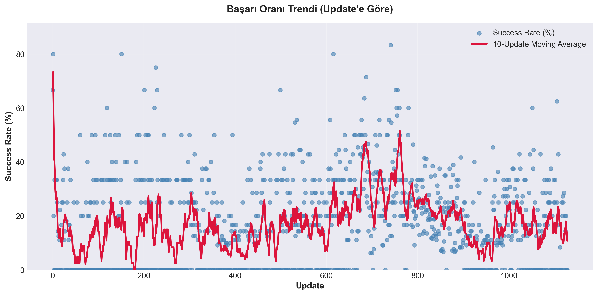
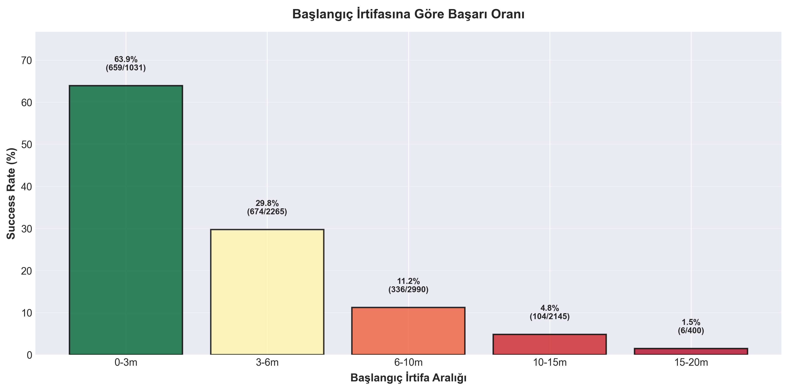
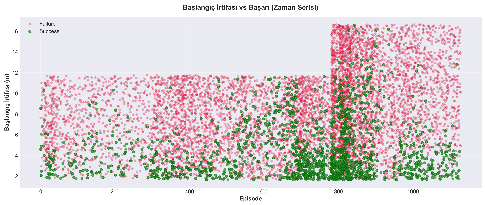
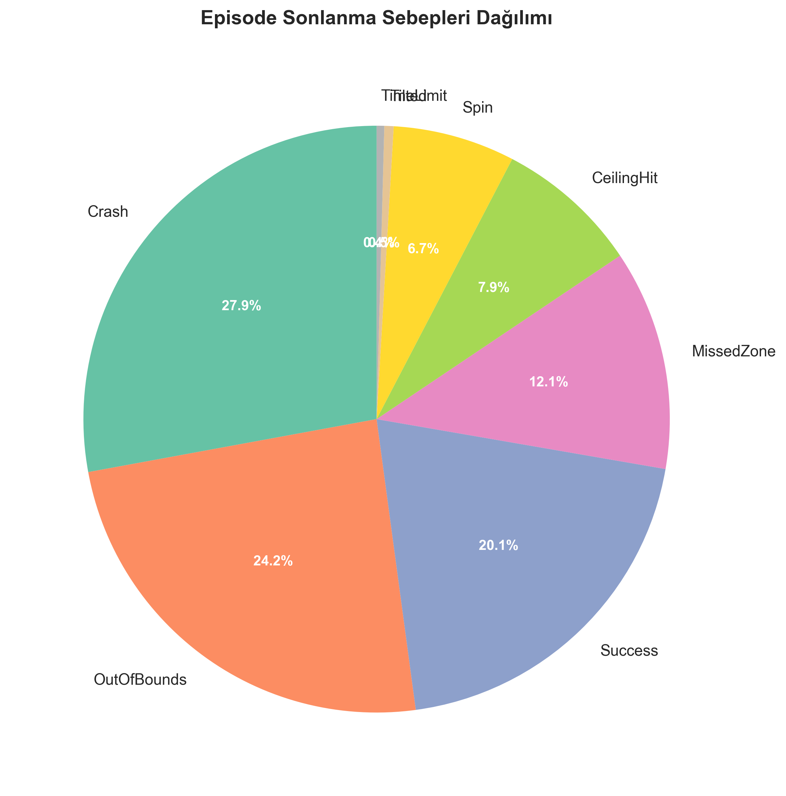
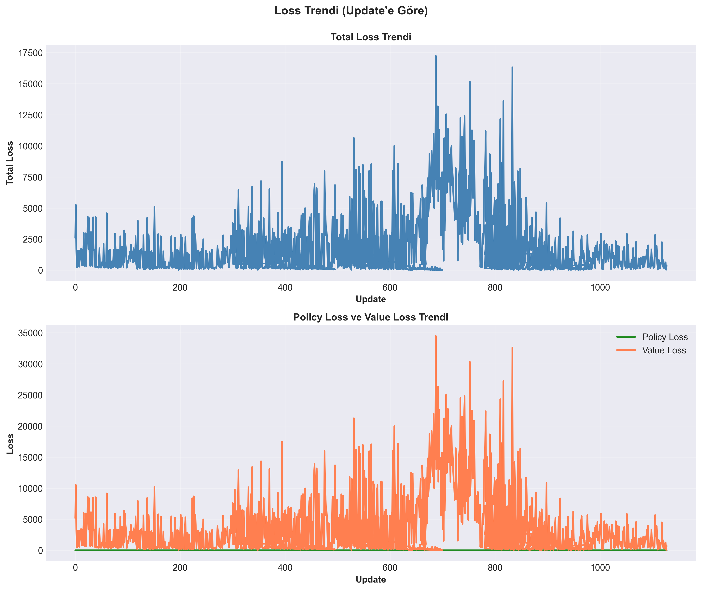
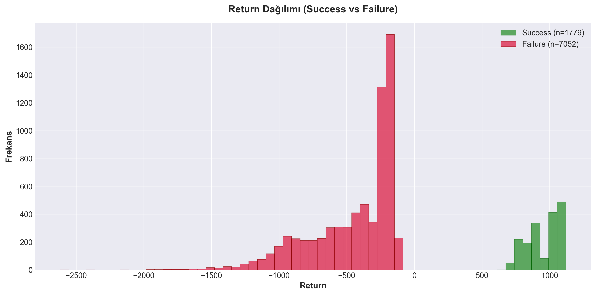

# Derin Öğrenme ile Dikey Roket İnişi

Unity fizik simülasyonu ve PPO (Proximal Policy Optimization) algoritması kullanarak bir AI ajanının otonom dikey roket inişleri gerçekleştirmesini öğreten derin pekiştirmeli öğrenme projesi.

## Proje Genel Bakış

Bu proje, bir roketin belirli bir hedef bölgeye dikey olarak iniş yapmasını öğreten kapsamlı bir RL (Pekiştirmeli Öğrenme) eğitim pipeline'ı uygular. Ajan, itki, pitch, yaw ve roll kontrollerini öğrenerek farklı başlangıç koşullarından (farklı irtifalar, yatay ofsetler ve başlangıç oryantasyonları) stabil inişler gerçekleştirir.

Eğitim, curriculum learning (müfredat öğrenme) yaklaşımı kullanır; düşük irtifa senaryolarından (5-15m) başlayıp orta irtifa senaryolarına (5-20m) kademeli olarak geçiş yapar. Proje, kapsamlı ödül şekillendirme, detaylı loglama ve performans analizi içerir.

## Önemli Özellikler

- **PPO Algoritması**: Genelleştirilmiş Avantaj Tahmini (GAE) ile Proximal Policy Optimization uygulaması
- **Unity Simülasyonu**: Unity 6 ile oluşturulmuş gerçekçi 3D fizik ortamı
- **Ödül Şekillendirme**: Birden fazla bileşene sahip gelişmiş ödül fonksiyonu (pozisyon, hız, oryantasyon cezaları/bonusları)
- **Müfredat Öğrenme**: Düşükten orta irtifa aralıklarına kademeli zorluk artışı
- **Kapsamlı Loglama**: Sonlanma sebepleriyle birlikte detaylı episode ve update logları
- **Model Kontrol Noktası**: Otomatik model kaydetme ve devam ettirme yeteneği
- **Test Senaryosu**: Eğitilmiş modelleri gerçek zamanlı test etmek için script

## Teknoloji Yığını

### Python Ortamı
- **Python**: 3.7.16 (Conda environment: `rl_codes`)
- **TensorFlow**: 2.10.1 (Keras API ile)
- **CUDA**: 13.0 (V13.0.48) - GPU desteği için
- **NumPy**: Sayısal hesaplamalar için
- **Unity Connector**: Python-Unity iletişimi için özel connector

**Not**: Bu proje `rl_codes` conda environment'ında geliştirilmiştir.

### Unity Ortamı
- **Unity Sürümü**: 6.0+ (Universal Render Pipeline)
- **Fizik Motoru**: Unity'nin yerleşik fizik motoru (Rigidbody tabanlı simülasyon)
- **İletişim**: Unity ve Python arasında TCP/IP socket bağlantısı

### Ana Kütüphaneler
```bash
numpy
tensorflow==2.10.1
```

**Kurulum için**:
```bash
conda activate rl_codes
pip install numpy tensorflow==2.10.1
```

## Proje Yapısı

```
vertical-landing-project/
├── scripts/
│   ├── train_main.py       # Ana eğitim scripti
│   ├── agent.py            # PPO ajan uygulaması
│   ├── env.py              # Ortam wrapper'ı ve ödül fonksiyonu
│   ├── connector.py        # Unity-Python iletişim köprüsü
│   └── play_test.py        # Model test scripti
├── rocket-env/             # Unity proje dizini
│   ├── Assets/
│   │   └── Scripts/
│   │       └── env.cs      # Unity ortam scripti
│   └── ...
├── models/                 # Eğitilmiş modeller ve loglar
│   ├── rocket_model_up*.keras
│   ├── episode_logs.csv
│   ├── update_logs.csv
│   ├── detailed_log.csv
│   └── low_stage_backup/   # En iyi düşük aşama modelinin yedeği
├── analyses/               # Eğitim analiz belgeleri
└── README.md
```

## Algoritma: PPO (Proximal Policy Optimization)

Bu projede **PPO** (Proximal Policy Optimization) algoritması kullanılıyor. PPO, pekiştirmeli öğrenmede kullanılan modern ve etkili bir yöntemdir.

**PPO'nun avantajları**:
- Büyük policy güncellemelerini önleyerek stabil eğitim sağlar
- Genelleştirilmiş Avantaj Tahmini (GAE) ile daha verimli öğrenme
- Ayrı policy ve value ağları ile daha iyi değer tahmini
- Entropy ile exploration (keşif) ve exploitation (sömürme) dengesini korur

### Ağ Mimarisi
- **Policy Ağı**: LeakyReLU aktivasyonlu 3 katmanlı MLP
  - Girdi: 13 boyutlu normalize edilmiş durum vektörü
  - Çıktı: Gaussian dağılımlarıyla 4 sürekli aksiyon (pitch, yaw, thrust, roll)
- **Value Ağı**: Aynı mimariyi paylaşan 3 katmanlı MLP
  - Çıktı: Skaler değer tahmini

### Ana Hiperparametreler
- Öğrenme Oranı: 1e-4
- İndirim Faktörü (γ): 0.99
- GAE Lambda (λ): 0.95
- Clip Epsilon: 0.1
- Değer Fonksiyonu Katsayısı: 0.5
- Entropy Katsayısı: 0.02
- Update Başına Epoch: 4
- Batch Boyutu: 256
- Maksimum Gradyan Normu: 0.5

## Durum ve Aksiyon Uzayı

### Durum Vektörü (13 boyut)
1. Yatay pozisyon X (dx)
2. İrtifa Y (dy) - roketin alt sensöründen ölçülen
3. Yatay pozisyon Z (dz)
4. Doğrusal hız X (vx)
5. Doğrusal hız Y (vy)
6. Doğrusal hız Z (vz)
7. Açısal hız X (wx)
8. Açısal hız Y (wy)
9. Açısal hız Z (wz)
10-13. Rotasyon quaternion'ı (qx, qy, qz, qw)

Durumlar, pozisyon/hız bileşenleri için log-compression kullanılarak normalize edilir.

### Aksiyon Uzayı (4 sürekli boyut)
- **Pitch**: X ekseni etrafında rotasyon [-1, 1]
- **Yaw**: Z ekseni etrafında rotasyon [-1, 1]
- **Thrust**: Ana motor itkisi [0, 1]
- **Roll**: Y ekseni etrafında rotasyon [-1, 1]

## Ödül Fonksiyonu

Ödül fonksiyonu birden fazla bileşenden oluşur:

### Terminal Ödüller
- **Success**: +2000 (temel) + zaman bonusu (0-300)
  - Koşullar: dy ≤ 1.7m, dist_h < 10.0m, |vy| ≤ 3.5 m/s, v_h ≤ 3.0 m/s, w_mag ≤ 5.0 rad/s
- **Crash**: -500 (yüksek dikey hız veya çarpışmada eğim)
- **CeilingHit**: -1200 (roket yukarı doğru hızla 50m irtifayı aşar)
- **OutOfBounds**: -650 (roket 35m yatay mesafeyi aşar)
- **MissedZone**: Kademeli ceza (mesafeye göre -150'den -350'ye)
- **Spin**: -400 (açısal hız 8.0 rad/s'yi aşar)
- **Tilted**: -300 (son oryantasyon dikeyden 15°'yi aşar)

### Adım Ödülleri
- Yatay mesafe cezası (kademeli: metre başına -0.1'den -0.25'e)
- Dikey hız cezası (irtifaya bağlı, kademeli)
- Yükseklik cezası (çok yüksekten başlama için)
- Yukarı hareket cezası (yükselmeyi caydırır)
- Yatay hız cezası (m/s başına -0.09)
- Açısal hız cezası (rad/s başına -0.04)
- Merkeze yaklaşma bonusu (üstel, en fazla +0.35)
- Yavaş iniş bonusu (en fazla +0.06)
- Yüksek irtifa ek cezası (dy > 30m)

Son adım ödülü, değer fonksiyonu öğrenimini stabilize etmek için 0.35x ile ölçeklenir.

## Eğitim Geçmişi

### Düşük Aşama (Başlangıç Yüksekliği: 5-15m)
- **Update 0-820**: Temel ödül şekillendirmesi ile ilk eğitim
- **Update 781-820**: Büyük iyileştirmeler
  - CeilingHit oranı: %0
  - Başarı oranı: ~%24
  - Spin oranı: Önemli ölçüde azaldı
  - En iyi model kontrol noktası: Update 820

### Orta Aşama Geçişi (Başlangıç Yüksekliği: 5-20m)
- **Update 801-910**: Ayarlanmış parametrelerle uzatılmış eğitim
  - Başarı oranı: ~%21
  - Crash oranı: Yüksek (~%60) - ana sorun olarak belirlendi
  - CeilingHit: Kontrol altında (~%1-2)
  - Loss stabilizasyon zorlukları

### Yapılan Önemli İyileştirmeler
1. **Ödül Şekillendirme**: Keşif ve sömürme dengesi için çoklu iterasyonlar
2. **CeilingHit Önleme**: Ceza artırıldı, yüksek irtifa kontrolleri eklendi, eşik düşürüldü
3. **MissedZone Yönetimi**: Kademeli ceza sistemi ve merkez bonusu artırıldı
4. **Spin Kontrolü**: Açısal hız cezaları güçlendirildi
5. **Durum Normalizasyonu**: Sinir ağı öğrenimi için log-compression
6. **Yükseklik Ölçümü**: Doğru irtifa takibi için sanal alt sensör uygulandı

## Başlangıç

### Önkoşullar
1. **Conda** kurulu olmalı (miniconda veya anaconda)
2. **Unity 6.0+** (simülasyonu çalıştırmak için)
3. **CUDA uyumlu GPU** (daha hızlı eğitim için önerilir, ancak CPU ile de çalışır)

### Kurulum

1. **Depoyu klonlayın veya indirin**

2. **Conda environment'ı aktif edin**:
   ```bash
   conda activate rl_codes
   ```

3. **Gerekli kütüphaneleri yükleyin** (eğer yüklü değilse):
   ```bash
   pip install numpy tensorflow==2.10.1
   ```

4. **Unity projesini hazırlayın**:
   - `rocket-env/` klasöründeki Unity projesini Unity Editor'de açın
   - Sahne içinde roket ve hedef nesnelerin olduğundan emin olun
   - Unity'de `BottomSensor` Transform'u roketin altına yerleştirin (doğru yükseklik ölçümü için)

### Eğitimi Çalıştırma

**1. Unity'yi başlatın**: Unity Editor'de Play butonuna basın

**2. Terminal'de eğitimi başlatın**:
```bash
cd scripts
python train_main.py
```

**Ne olacak?**
- Script otomatik olarak en son kaydedilmiş modeli bulur ve yükler (varsa)
- Eğitime kaldığı yerden devam eder
- Her 20 update'te bir model otomatik olarak kaydedilir (`models/` klasörüne)
- Tüm episode'lar ve metrikler CSV dosyalarına kaydedilir

**Eğitimi durdurmak için**: `Ctrl+C` tuşlarına basın. Son kaydedilen checkpoint'ten devam edebilirsiniz.

### Eğitilmiş Modeli Test Etme

**1. Unity'yi başlatın**: Unity Editor'de Play butonuna basın

**2. Terminal'de test scriptini çalıştırın**:
```bash
cd scripts
python play_test.py --model_path ../models/rocket_model_up820.keras
```

**Test scripti ne yapar?**
- Belirttiğiniz modeli yükler
- Rastgele başlangıç koşullarıyla sürekli iniş denemeleri yapar
- Başarılı bir iniş olduğunda 2-3 saniye bekler (Unity'de sonucu görebilirsiniz)
- Otomatik olarak yeni bir deneme başlatır

**En iyi modeli test etmek için**:
```bash
python play_test.py --model_path ../models/low_stage_backup/rocket_model_up820_low_stage_final.keras
```

## Model Performansı

### En İyi Model

**Düşük Aşama Final Modeli**: `rocket_model_up820.keras`

Bu model, düşük irtifa senaryoları (5-15m) için en iyi performansı gösteriyor:
- **Başarı Oranı**: ~%24 (düşük irtifa aralığında)
- **CeilingHit**: %0 (tamamen kontrol altında!)
- **Stabil İnişler**: Çeşitli başlangıç koşullarından başarılı inişler
- **Yedek**: `models/low_stage_backup/` klasöründe yedeklenmiş

### Eğitim Metriklerini İnceleme

Eğitim sırasında oluşturulan log dosyaları:
- **`episode_logs.csv`**: Her episode'un getirisi ve uzunluğu
- **`update_logs.csv`**: Loss, entropy, KL divergence gibi training metrikleri
- **`detailed_log.csv`**: Her episode'un detaylı bilgisi (başlangıç koşulları, sonlanma sebebi, vs.)
- **`state_log.csv`**: Her adımdaki durum ve aksiyon verileri (debug için)

Bu dosyaları Excel veya Python (pandas) ile açıp analiz edebilirsiniz.

## Yapılandırma

### Eğitim Parametrelerini Değiştirme

Ana eğitim parametrelerini `scripts/train_main.py` dosyasında bulabilirsiniz:

```python
ROLLOUT_LEN = 1800        # Her update'te toplanacak adım sayısı
TOTAL_UPDATES = 10000     # Toplam eğitim update sayısı
SAVE_EVERY_UPDATES = 20   # Model kaydetme sıklığı (her N update'te bir)
```

### Ortam Parametrelerini Değiştirme

Roket başlangıç koşulları, ödül fonksiyonu ve başarı kriterleri `scripts/env.py` dosyasında tanımlanmıştır:

- `init_y_min`, `init_y_max`: Başlangıç yüksekliği aralığı
- `init_x_min`, `init_x_max`: Yatay X pozisyon aralığı
- `init_z_min`, `init_z_max`: Yatay Z pozisyon aralığı
- Ödül miktarları ve eşik değerleri

**Dikkat**: Parametreleri değiştirdikten sonra eğitime sıfırdan başlamanız veya en azından eski modelle uyumlu olduğundan emin olmanız gerekebilir.

## Analiz ve Dokümantasyon

`analyses/` klasörü detaylı eğitim analizleri ve tartışmalar içerir:
- Belirli update aralıkları için performans değerlendirmeleri
- Ödül fonksiyonu tasarım kararları
- Sorun giderme kılavuzları
- Eğitim stratejisi tartışmaları

## Karşılaşılan Sorunlar ve Çözümler

Eğitim sırasında karşılaşılan bazı sorunlar ve nasıl çözüldükleri:

### 1. Ödül Sömürüsü (Reward Hacking)
**Sorun**: Ajan, cezaları azaltmak için irtifa kazanarak ödül fonksiyonunu "hack" etmeye çalıştı.

**Çözüm**: 
- Yukarı doğru hareket cezası artırıldı
- Yüksek irtifa için ek cezalar eklendi
- CeilingHit eşiği düşürüldü (60m → 50m)

### 2. Değer Fonksiyonu Kararsızlığı
**Sorun**: Büyük başarı ödülleri (örn. +2000) değer fonksiyonunda ani sıçramalara neden oldu.

**Çözüm**: Tüm step ödüllerini 0.35x ile ölçekleyerek değerleri daha yönetilebilir aralığa çektik.

### 3. Spin Problemi
**Sorun**: Roket yüksek açısal hızlarla dönerek kararsız hale geldi.

**Çözüm**: 
- Açısal hız cezası artırıldı (-0.01 → -0.04)
- Başarı kriterlerinde maksimum açısal hız sınırı eklendi

### 4. Yüksek Crash Oranı
**Sorun**: Orta irtifa eğitimlerinde crash oranı çok yüksekti (%60).

**Durum**: Bu sorun hala devam ediyor. Muhtemelen mesafe cezalarının çok agresif olması veya başarı kriterlerinin çok katı olması ile ilgili.

## Gelecek İyileştirmeler

Projeyi geliştirmek için yapılabilecekler:
- Crash oranını düşürmek için ödül fonksiyonunu optimize etme
- Uyarlamalı müfredat öğrenme (zorluk seviyesi otomatik artışı)
- Rüzgar gibi çevresel bozulmalar ekleme (daha gerçekçi simülasyon)
- Daha yüksek irtifalardan iniş (50m+)
- Çoklu roket senaryoları
- Görsel girdi kullanımı (kamera görüntüsü ile CNN)

## Log Analizi ve Görselleştirme

Eğitim sırasında oluşturulan log dosyalarından detaylı analizler yapmak ve grafikler oluşturmak için Python scripti (matplotlib/seaborn) kullanılabilir.

### Analiz Scriptini Çalıştırma

**1. Python environment'ını aktif edin** (rl_codes veya DL_YOLO):
```bash
conda activate rl_codes
# veya
conda activate DL_YOLO
```

**2. Gerekli kütüphaneleri yükleyin** (eğer yoksa):
```bash
pip install matplotlib seaborn pandas numpy
```

**3. Scripti çalıştırın**:
```bash
cd scripts
python analyze_training.py
```

Script şu grafikleri otomatik olarak oluşturur ve PNG formatında kaydeder:

#### 1. Success Rate Trendi
Update'lere göre başarı oranının nasıl değiştiğini gösterir (10-update moving average ile).



#### 2. Başlangıç İrtifası vs Success
Hangi irtifa aralıklarından daha başarılı inişler yapıldığını gösterir. Her bar üzerinde success oranı ve episode sayısı gösterilir.



#### 3. Başlangıç İrtifası Scatter Plot
Episode'lara göre başarılı (yeşil) ve başarısız (kırmızı) inişlerin başlangıç irtifası dağılımı. Zaman içindeki değişimi gösterir.



#### 4. Termination Reason Dağılımı
Hangi sebeplerle episode'ların bittiğini gösteren pasta grafiği. En yaygın 8 sebep gösterilir.



#### 5. Loss Trendi
Policy loss ve value loss'un eğitim boyunca değişimi (update_logs.csv varsa).



#### 6. Return Dağılımı
Başarılı ve başarısız episode'ların return değerlerinin histogram karşılaştırması.



**Çıktı**: 
- Tüm grafikler PNG formatında `images/` klasörüne kaydedilir
- Script çalıştırıldıktan sonra özet istatistikler konsola yazdırılır
- Grafikler README.md'ye otomatik olarak eklenebilir

### Örnek Analiz Soruları

Bu grafiklerle şu sorulara cevap bulabilirsiniz:

- **Başarı oranı zamanla artıyor mu?** → Success Rate Trend grafiğine bakın (moving average eğilimini gösterir)
- **Hangi başlangıç irtifalarından iniş daha zor?** → Başlangıç İrtifası vs Success grafiğine bakın (düşük bar = zor irtifa)
- **Model hangi hataları daha sık yapıyor?** → Termination Reason dağılımına bakın (en büyük dilim = en yaygın hata)
- **Eğitim stabil mi, yoksa loss çok mu değişken?** → Loss Trend grafiğine bakın (düzgün düşüş = iyi)
- **Yüksek başlangıç irtifalarından başarılı inişler yapılıyor mu?** → Scatter plot'a bakın (yeşil noktalar yüksekte mi?)

### Özelleştirme

MATLAB scriptini düzenleyerek kendi analizlerinizi de ekleyebilirsiniz:
- Belirli update aralıklarına odaklanma (Update değişkenini filtreleyin)
- Farklı grafik türleri (box plot, violin plot, vb.)
- Başlangıç mesafesi vs başarı analizi (StartDist kullanın)
- Update başına episode sayısı analizi

## İpuçları ve Öneriler

- **İlk başlangıç**: Önce `play_test.py` ile eğitilmiş bir modeli test ederek Unity bağlantısının çalıştığını kontrol edin
- **Eğitim sırasında**: Unity Editor'de roketin davranışını izleyebilirsiniz
- **Log analizi**: `analyze_training.py` scriptini kullanarak training sürecini görsel olarak analiz edin
- **Model yedekleme**: Önemli checkpoint'leri mutlaka yedekleyin
- **GPU kullanımı**: CUDA kurulu değilse CPU ile de çalışır, ancak çok daha yavaş olacaktır
- **Grafik analizi**: Eğitim sonrası mutlaka grafikleri inceleyin - hangi aşamada sorunlar olduğunu görebilirsiniz

## Lisans

[Lisansınızı buraya belirtin]

## Teşekkürler

- Unity Technologies - fizik motoru için
- OpenAI - PPO algoritması için
- TensorFlow ekibi - derin öğrenme framework'ü için

## İletişim

[İletişim bilgileriniz]

